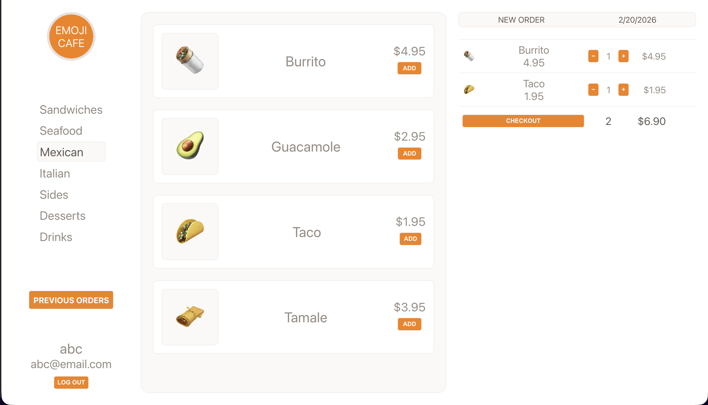

# Emoji Cafe

Emoji Cafe is a full-stack restaurant ordering app where users can browse a menu, add items to a cart, place orders, and view order history — all with emoji-themed food items.



## Features

- User authentication (sign up / log in / log out)
- Browse menu items by category
- Add items to cart with quantity controls
- Place orders and checkout
- View previous order history

## Tech Stack

- **Frontend:** React, CSS
- **Backend:** Node.js, Express
- **Database:** MongoDB, Mongoose
- **Auth:** JSON Web Tokens (JWT), bcrypt

## Getting Started

### 1. Clone the repo

```bash
git clone https://github.com/aibekz/emoji-cafe.git
cd emoji-cafe
```

### 2. Install dependencies

```bash
pnpm install
# or
npm install
```

### 3. Set up environment variables

Create a `.env` file in the root directory:

```
DATABASE_URL=mongodb://localhost:27017/emoji-cafe
SECRET=your_jwt_secret
```

### 4. Seed the database

```bash
node seed.js
```

### 5. Run the app

Start both the React dev server and the API server:

```bash
# Terminal 1 — React client
npm start

# Terminal 2 — API server
npm run dev
```

The client runs on `http://localhost:3000` and proxies API requests to port `3001`.

## Build for Production

```bash
npm run build
node server.js
```

The Express server serves the built React app from the `/build` directory.
